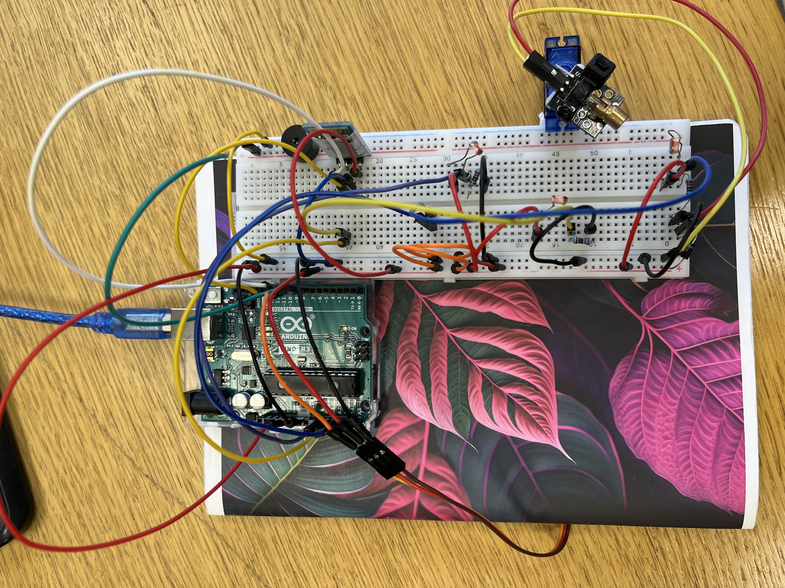

# Arduino-laser-security-system

Laser security system, that uses components like diode, servo motor, buzzer, zs-040 bluetooth connector, ldr's, laser, resistors.

Project PDF: 
(To be continued)

# Wiring Guide

Servo Motor:
  Signal (Orange) → Pin 9
  Power (Red) → 5V
  Ground (Brown) → GND

Laser Module:
  VCC → 5V
  GND → GND
  (Signal optional on Pin 7)

Photoresistor Array (3 zones):
  LDR_Left: 5V → LDR → A0 → 220Ω → GND
  LDR_Center: 5V → LDR → A1 → 220Ω → GND  
  LDR_Right: 5V → LDR → A2 → 220Ω → GND

Buzzer:
  Positive → Pin 8
  Negative → GND

# Features
- Laser Protection: 3-zone scanning system with individual breach detection
- Automated Servo Scanning: Motorized laser sweeps between customized positions (Left. Right, Center)
- Real-time Threat Detection: Photoresistor sensors monitor laser beam integrity
- Smart Alarm System: Escalating alerts with visual and audio indicators
- Wireless Bluetooth Control: Remote monitoring and command via HC-05 module
- Status Indicators: Diode and transistor-driven LED feedback system
- Event-Driven Architecture: Non-blocking, asynchronous operation
- Customizable Zones: Programmable servo angles for precise positioning

This laser security system provides professional-grade intrusion detection with flexible configuration and remote monitoring capabilities, making it ideal for both educational demonstrations and practical security applications.

# Things to do:
- Fix bluetooth connection
- Upgrade lazer

